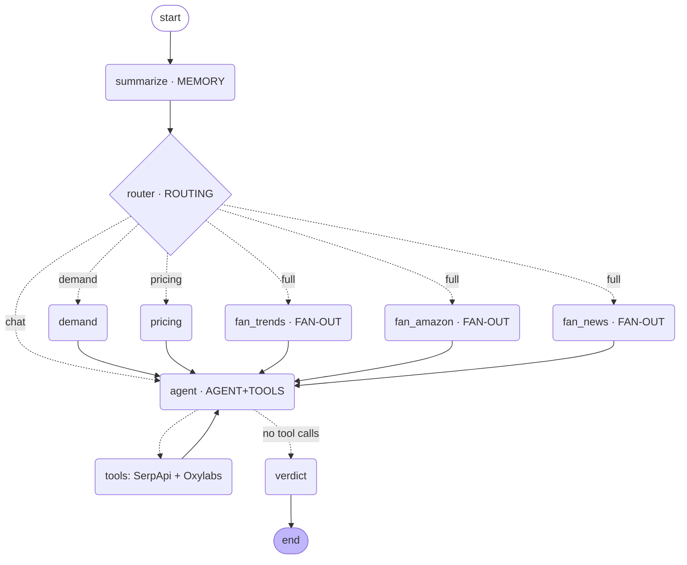

# LaunchLens 🔭

**Is this product worth launching?**

LaunchLens is a command-line chat agent for founders. You describe a product
idea in plain English; it researches the idea live by **fusing demand signals
from Google (via SerpApi)** with **supply signals from Amazon (via Oxylabs)**,
then returns a clear **Go / No-Go / Niche** verdict covering demand, a price
band, and positioning — and keeps the conversation going with memory.

> The core insight: **Oxylabs tells you what's *selling*. SerpApi tells you what
> the market *wants*. LaunchLens connects them.** Demand rising + Amazon reviews
> complaining "it leaks" = a real opportunity. That fusion is the whole product.

Built for Assignment 3 (LaunchLens) — *LangGraph for Production AI Agents*.

---

## 🎬 Demo video

A 2-minute walkthrough — what LaunchLens is, the data-fusion architecture, and a
live conversation with a real Go/No-Go verdict and memory across turns.

[](https://www.youtube.com/watch?v=zAA_MEcIPOk)

▶️ **Watch:** https://www.youtube.com/watch?v=zAA_MEcIPOk

---

## Quickstart

```bash
# 1. clone, then from the repo root:
python -m venv .venv && source .venv/bin/activate    # Windows: .venv\Scripts\activate
pip install -r requirements.txt

# 2. configure
cp .env.example .env        # fill in keys (or leave MOCK_MODE=true to run offline)

# 3. run the chat agent
python -m app.main
```

You can run **immediately with no API keys**: `MOCK_MODE=true` (the default) uses
saved JSON fixtures in `app/fixtures/`. To make real calls, set `MOCK_MODE=false`
and provide `SERPAPI_API_KEY`, `OXYLABS_USERNAME`/`OXYLABS_PASSWORD`, and an LLM
key (`QWEN_API_KEY` for Qwen cloud, the default; or `OPENAI_API_KEY` if you set
`LLM_PROVIDER=openai`). The agent (LLM) always needs one working LLM key.

Resume a conversation later (memory survives restarts):

```bash
python -m app.main --thread my-bottle-idea     # reuse the id to resume
python -m app.main --new                        # start a fresh thread
```

---

## Demo script (try these in order)

1. `Is a 32oz stainless-steel insulated water bottle worth launching in the US under $40?`
   → full report: fan-out pulls Trends + Amazon + News in parallel, agent fuses them, returns a verdict.
2. `What price should I sell it at?`
   → pricing branch fuses Google Shopping + Amazon prices.
3. `What are people complaining about in reviews?`
   → agent calls `amazon_product` and surfaces review gaps.
4. `Is demand actually trending up?`
   → demand branch (Google Trends).
5. `Now compare it with the Canada market.`  … keep going for several turns …
6. After the chat gets long, the **summarization node** compresses old turns
   automatically — ask `what did we conclude earlier?` to see memory + summary at work.

---

## Architecture / graph diagram



Regenerate the live diagram anytime with:
`python -c "from app.graph import build_graph; print(build_graph().get_graph().draw_mermaid())"`

---

## Concept map — where each required concept lives

| # | Concept | File | Function / node | Line(s) | Note |
|---|---------|------|-----------------|---------|------|
| 1 | **Graph & state** | `app/state.py` · `app/graph.py` | `State`, `merge_research`; `build_graph` | state.py 16, 28; graph.py 47 | Typed `StateGraph` state; two reducer channels (`add_messages`, `merge_research`). |
| 2 | **Fan-out (parallel)** | `app/graph.py` · `app/nodes.py` | `route`→`fan_trends/fan_amazon/fan_news` | graph.py 68–84; nodes.py 107, 113, 119 | Router returns a 3-node list → parallel pulls → merge on `agent` via `merge_research`. |
| 3 | **Routing (conditional edges)** | `app/router.py` · `app/graph.py` | `classify_intent`, `route`; `add_conditional_edges` | router.py 65, 81; graph.py 68 | Classifies intent (demand / pricing / full / chat) and branches, with a `chat` default. |
| 4 | **Agent node + tools** | `app/nodes.py` · `app/graph.py` · `app/tools/` | `agent_node`; `ToolNode` + `route_agent` (per-turn tool budget) | nodes.py 160; graph.py 28, 60, 88 | LLM bound to 6 SerpApi/Oxylabs tools; agent↔tools loop capped by `TOOL_BUDGET`; tools return slim JSON. |
| 5 | **Short-term memory** | `app/main.py` · `app/nodes.py` | `SqliteSaver` checkpointer; `summarize_node` | main.py 140; nodes.py 73 | Checkpointer survives restarts (keyed by thread_id) **+** summarization bounds context. |

---

## Data sources

**Demand — SerpApi** (`app/tools/serpapi_tools.py`): Google **Trends**, Google
**News**, Google **Shopping**. **Supply — Oxylabs** (`app/tools/oxylabs_tools.py`):
`amazon_search`, `amazon_product` (incl. mined review complaints),
`amazon_bestsellers`. Every tool returns **slim JSON** (a few fields), never the
raw payload, to keep tokens and context bounded.

**Live vs mocked:** `MOCK_MODE=true` serves fixtures from `app/fixtures/` so the
graph is fully runnable offline. For the demo, set `MOCK_MODE=false` to show at
least one real live call per provider.

---

## How this scales

State is fully checkpointed (SQLite locally; swap `SqliteSaver` for
`PostgresSaver` for production — same interface). Concurrency is handled by
`thread_id`, so many founders can chat in parallel against the same process.
Config and secrets come from env vars (no hardcoding). Tool outputs are slimmed
and the summarization node keeps the context window bounded as chats grow, so
per-turn cost stays roughly flat instead of growing with conversation length.

---

## Project layout

```
launchlens/
├── app/
│   ├── main.py             # CLI chat loop + SQLite checkpointer (memory)
│   ├── graph.py            # StateGraph wiring (all 5 concepts)
│   ├── state.py            # typed state + reducers
│   ├── router.py           # intent classification + conditional routing
│   ├── nodes.py            # summarize / fan-out / agent / verdict nodes
│   ├── config.py           # env-driven config + LLM factory
│   ├── tools/
│   │   ├── serpapi_tools.py   # demand: Trends, News, Shopping
│   │   └── oxylabs_tools.py   # supply: amazon search/product/bestsellers
│   └── fixtures/           # mock JSON for MOCK_MODE
├── smoke_test.py           # offline test: routing, fan-out merge, memory
├── requirements.txt
├── .env.example
└── SUBMISSION.md
```

Run the offline test: `python smoke_test.py`

---

## Future enhancements

- **Unit-economics / FBA price-comparison module.** Today the agent *reasons*
  about margin qualitatively (prompted to weigh COGS, marketplace fees, and ad
  cost), but it has no hard numbers. A dedicated tool would turn a target price
  into an actual margin verdict: estimate COGS (Alibaba/category heuristic or
  founder input), apply Amazon's referral (~15%) + FBA fulfillment fee tiers by
  size/weight, fold in a category PPC/ACoS estimate, and compare net margin
  against competitor price points. This converts "there's a price gap at $20"
  into "you net $X at $20 after fees and ads — Go/No-Go."

## Authors

- Ruby Gunna Janarthanan

> AI assistants were used during development; every line is understood and explainable.
